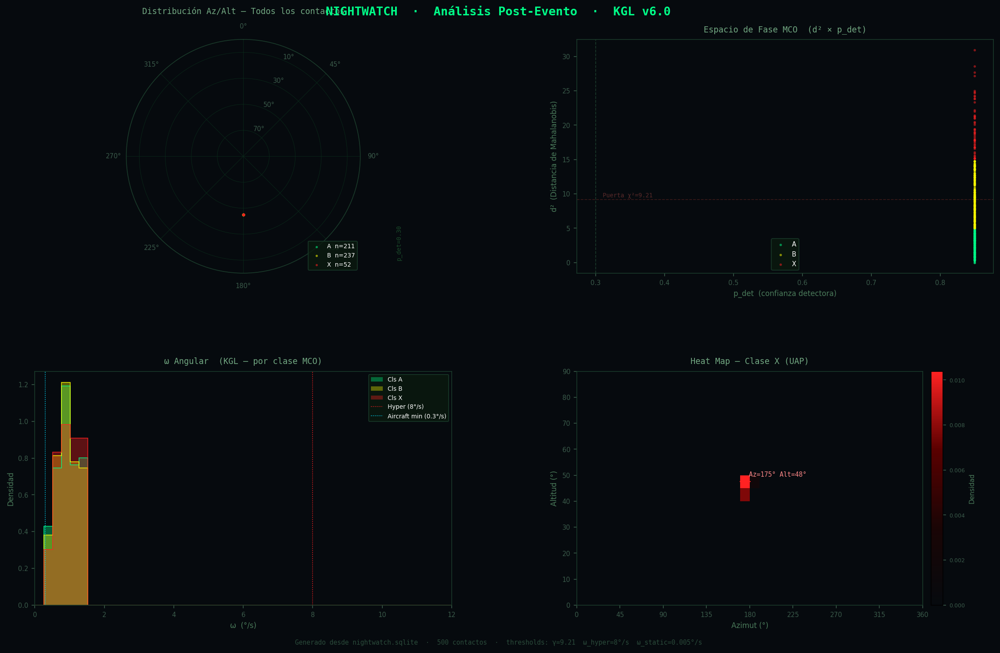

# NIGHTWATCH

**Real-time detection, tracking and classification of overhead objects in infrared imagery.**

A CUDA-accelerated vision pipeline that finds faint moving objects in IR/ToF frames,
tracks them, cross-matches them against the satellite catalogue, and flags the ones
that don't belong. Classical signal processing (CA-CFAR) feeds a lightweight
spatiotemporal neural net; a Kalman tracker and a TLE catalogue match turn raw blobs
into identified tracks. Detections are persisted to a local store the system learns
from over time.

<p align="center">
  
</p>

## Pipeline

```
  IR / ToF frames                CUDA                     classify + track
  ───────────────   ─────────────────────────────   ──────────────────────────
  sensor or          CA-CFAR blob detection           MobileViT-XT (spatio-
  synthetic ToF  ─▶  (constant false-alarm rate,  ─▶  temporal, ONNX/TensorRT) ─┐
  (synth_tof.cu)     vision_kernel.cu)                                          │
                                                                               ▼
   ┌───────────────────────────────────────────────────────────────────────────┐
   │  Kalman tracking (Mahalanobis gating)  →  TLE catalogue cross-match         │
   │  (space_oracle.py, Skyfield/Celestrak)  →  5-class label:                   │
   │     catalogued · uncatalogued · aircraft · debris · anomalous              │
   └───────────────────────────────┬───────────────────────────────────────────┘
                                    ▼
   SQLite store (learns from detections)  →  FastAPI/WebSocket dashboard
   (nightwatch_db.py)                          (nightwatch_dashboard.py)
                                    ▼
   anomalous track  →  slew-to-cue hardware bridge (Jetson + servo, Arduino)
```

## Components

| File | Role |
|------|------|
| `vision_kernel.cu` | CUDA CA-CFAR blob detection (constant false-alarm-rate thresholding) |
| `synth_tof.cu` | Synthetic ToF/IR frame generator — realistic sensor noise, no hardware needed |
| `main.cpp` / `nightwatch_vision.h` | C++/CUDA pipeline orchestrator |
| `trackformer.py` | MobileViT-XT spatiotemporal classifier (factorized attention) |
| `train.py` / `export.py` / `validate_onnx.py` | Train, export to ONNX, validate PyTorch↔ONNX parity |
| `trackformer_trt.{cpp,h}` | TensorRT inference bridge |
| `space_oracle.py` | TLE catalogue cross-match (Skyfield + Celestrak) |
| `nightwatch_db.py` / `populate_db.py` | SQLite detection store (the system learns from what it sees) |
| `nightwatch_dashboard.py` | FastAPI + WebSocket live dashboard |
| `acoustic/` | LITHOS — complementary acoustic-sensing module (C++) |
| `nightwatch_mega/` | Arduino Mega firmware for servo slew-to-cue |

## Sensor input

The pipeline is sensor-agnostic. The default build runs on a **synthetic ToF/IR
generator** (`synth_tof.cu`) with a realistic noise model, so the whole vision stack
can be developed and tested offline. Live capture is a plug-in point: wire a ToF/IR
sensor's SDK into the build (`NIGHTWATCH_USE_SENSOR`) and feed frames to the same
kernels.

## Status

**Implemented:** CUDA CA-CFAR detection · synthetic ToF generator · MobileViT-XT
classifier (train / export / validate) · Kalman tracking · TLE catalogue match ·
SQLite store · FastAPI dashboard · acoustic LITHOS module.

**In progress:** live-sensor capture integration · TensorRT INT8 engine wiring ·
hardware slew-to-cue (Jetson + Arduino servo bridge). Benchmarks (throughput,
classification accuracy) are not yet published — they will be measured and reported
honestly rather than asserted here.

## Build / run

```bash
# Synthetic vision pipeline (no sensor required)
# Windows:
build.bat --synthetic
# Linux / WSL2:
make

# Train / export the classifier
python train.py
python export.py
python validate_onnx.py
# TensorRT engine:
trtexec --onnx=NIGHTWATCH_MOBILEVIT_XT.onnx --int8 --saveEngine=NIGHTWATCH_MOBILEVIT_XT.engine

# Dashboard
python nightwatch_dashboard.py
```

Requires: CUDA toolkit + nvcc, an MSVC/GCC C++17 toolchain, OpenCV, and the Python
deps in `requirements.txt`. The OpenCV runtime DLL is **not** vendored in the repo —
provide it from your OpenCV/UE install (see `build.bat`).

## Stack

`C++17` · `CUDA` · `Python` · `OpenCV` · `PyTorch` · `ONNX` · `TensorRT` · `FastAPI` ·
`Skyfield` · `SQLite`

---

*Local-first IR situational awareness. Synthetic by default, real-sensor ready.*
